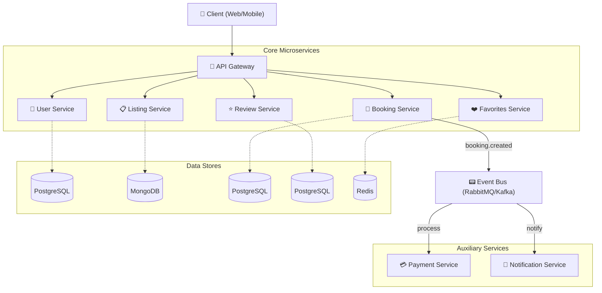

# RaaS – Rental as a Service
### 🚀 Skalowalny System Wynajmu w Architekturze Mikroserwisowej

[](https://github.com/) 
[](https://github.com/) 
[](https://github.com/)

**RaaS** to kompleksowa, rozproszona platforma typu marketplace (Airbnb/OLX/Otodom clone), zaprojektowana do elastycznego wynajmu dowolnych zasobów (samochody, mieszkania, sprzęt). Projekt kładzie nacisk na nowoczesne wzorce projektowe, komunikację asynchroniczną i wysoką dostępność.

---

## 🏗️ Architektura Systemu

System składa się z niezależnych mikroserwisów komunikujących się ze sobą synchronicznie (REST/gRPC) oraz asynchronicznie poprzez system kolejkowy (Event-Bus).



---

## 📦 Przegląd Mikroserwisów

| Serwis | Odpowiedzialność | Technologie (Sugerowane) |
| :--- | :--- | :--- |
| **User Service** | Zarządzanie profilami, Auth (JWT/OAuth2), uprawnienia. | **Java (Spring Boot)** + PostgreSQL |
| **Listing Service** | Zarządzanie ogłoszeniami (CRUD), kategorie, zdjęcia/media. | **Go** + MongoDB |
| **Booking Service** | Cykl życia rezerwacji, sprawdzanie dostępności (Concurrency). | **Go** + Redis + PostgreSQL |
| **Payment Service** | Procesowanie płatności, integracja ze Stripe/PayPal, fakturowanie. | **Java (Spring Boot)** |
| **Notification Service** | Wysyłka powiadomień (Email, SMS, Push). | **Go** + SendGrid/Twilio |
| **Review Service** | Oceny i opinie do rezerwacji (zarządzanie ratingami ofert). | **Java (Spring Boot)** + PostgreSQL |
| **Favorites Service** | Lista życzeń / obserwowanych (szybki skrót ulubionych ogłoszeń). | **Java (Spring Boot)** + Redis |

---

## ⚡ Komunikacja Asynchroniczna (Event-Driven)

RaaS implementuje wzorzec **Saga** do zarządzania transakcjami rozproszonymi. Przykładowy przepływ:
1.  **Booking Service** (Go) tworzy rezerwację → emituje `booking.placed`.
2.  **Payment Service** (Java) odbiera event → inicjuje płatność → emituje `payment.succeeded`.
3.  **Booking Service** aktualizuje status na `confirmed`.
4.  **Notification Service** (Go) wysyła potwierdzenie do użytkownika.

---

## 🛠️ Stack Technologiczny

- **Backend:** Java (Spring Boot), Go (Golang)
- **Frontend:** Angular.js
- **Bazy Danych:** PostgreSQL, MongoDB, Redis (Cache/Distributed Lock)
- **Komunikacja:** Apache Kafka (Event Bus)
- **DevOps:** Docker, Kubernetes

---

## 🚀 Szybki Start (Development)

Wymagany jest zainstalowany **Docker** oraz **Docker Compose**.

1.  Sklonuj repozytorium:
    ```bash
    git clone https://github.com/YourUser/RaaS.git
    cd RaaS
    ```

2.  Uruchom infrastrukturę i serwisy:
    ```bash
    docker-compose up -d
    ```

3.  Sprawdź status serwisów:
    ```bash
    docker-compose ps
    ```

---

## 🗺️ Roadmap projektu

- [ ] Implementacja bazowego `User Service` z Auth
- [ ] Stworzenie `Listing Service` (Core CRUD)
- [ ] Wdrożenie `Event Bus` do komunikacji między serwisami
- [ ] Integracja bramki płatności (Stripe Sandbox)
- [ ] Implementacja systemu opinii w `Review Service`
- [ ] Migracja z Docker Compose na Kubernetes (szablony Helm)
- [ ] Deployment środowiska produkcyjnego na maszynie wirtualnej (VM)

---

## 👨‍💻 Dla Dewelopera

Projekt jest idealny do nauki:
- Architektury mikroserwisowej i transakcji rozproszonych.
- Systemów opartych na zdarzeniach (Event-Driven Design).
- Optymalizacji zapytań w bazach danych i wyszukiwarkach (NoSQL vs SQL).
- Konteneryzacji i orkiestracji.