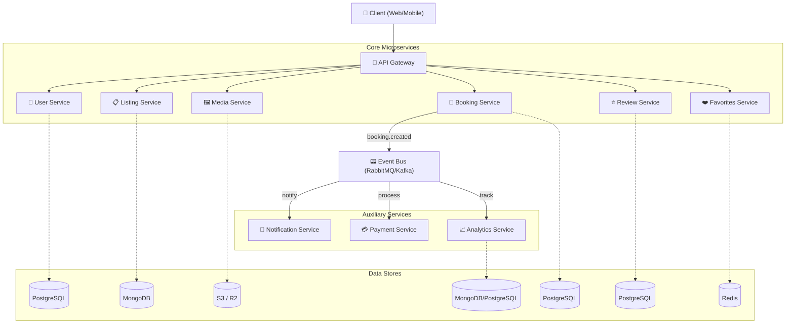

# RaaS – Rental as a Service

### 🚀 Scalable Rental System in a Microservices Architecture

[](https://github.com/)
[](https://github.com/)
[](https://github.com/)

**RaaS** is a comprehensive, distributed marketplace platform (Airbnb/OLX/Otodom clone), designed for flexible rental of any resources (cars, apartments, equipment). The project emphasizes modern design patterns, asynchronous communication, and high availability.

---

## 🏗️ System Architecture

The system consists of independent microservices communicating with each other synchronously (REST/gRPC) and asynchronously through a message broker (Event-Bus).


```mermaid
graph TD
    Client["📱 Client (Web/Mobile)"] --> Gateway["🚪 API Gateway"]

    subgraph "Core Microservices"
        Gateway --> US["👤 User Service"]
        Gateway --> LS["📋 Listing Service"]
        Gateway --> MS["🖼️ Media Service"]
        Gateway --> BS["📅 Booking Service"]
        Gateway --> RS["⭐ Review Service"]
        Gateway --> FS["❤️ Favorites Service"]
    end

    subgraph "Auxiliary Services"
        PS["💳 Payment Service"]
        NS["🔔 Notification Service"]
        AS["📈 Analytics Service"]
    end

    BS -- "booking.created" --> EB["📟 Event Bus (RabbitMQ/Kafka)"]
    EB -- "notify" --> NS
    EB -- "process" --> PS
    EB -- "track" --> AS

    subgraph "Data Stores"
        US_DB[(PostgreSQL)]
        LS_DB[(MongoDB)]
        MS_DB[(S3 / R2)]
        BS_DB[(PostgreSQL)]
        RS_DB[(PostgreSQL)]
        FS_DB[(Redis)]
        AS_DB[(MongoDB/PostgreSQL)]
    end

    US -.-> US_DB
    LS -.-> LS_DB
    MS -.-> MS_DB
    BS -.-> BS_DB
    RS -.-> RS_DB
    FS -.-> FS_DB
    AS -.-> AS_DB
```

---

## 📦 Microservices Overview

| Service                  | Responsibility                                                           | Technologies (Suggested)                |
| :----------------------- | :----------------------------------------------------------------------- | :-------------------------------------- |
| **Listing Service**      | Listing management (CRUD), categories, photos/media.                     | **Go** + MongoDB                        |
| **Media Service**        | Upload and photo management                                              | **Go** + S3 (e.g. Cloudflare R2)        |
| **Booking Service**      | Booking lifecycle, availability checking (Concurrency).                  | **Go** + Redis + PostgreSQL             |
| **Payment Service**      | Payment processing, Stripe/PayPal integration, invoicing.                | **Java (Spring Boot)**                  |
| **Review Service**       | Ratings and reviews for bookings (listing rating management).            | **Java (Spring Boot)** + PostgreSQL     |
| **Favorites Service**    | Wishlist / watched (quick shortcut for favorite listings).               | **Java (Spring Boot)** + Redis          |
| **Notification Service** | Sending notifications (Email, SMS, Push).                                | **Python** + SendGrid/Twilio            |
| **User Service**         | Profile management, Auth (JWT/OAuth2) / Google Integration, permissions. | **Python** + PostgreSQL                 |
| **Analytics Service**    | Collecting events and statistics                                         | **Python** + Kafka + MongoDB/PostgreSQL |

---

## ⚡ Asynchronous Communication (Event-Driven)

RaaS implements the **Saga** pattern to manage distributed transactions. Example flow:

1.  **Booking Service** (Go) creates a booking → emits `booking.placed`.
2.  **Payment Service** (Java) receives the event → initiates payment → emits `payment.succeeded`.
3.  **Booking Service** updates status to `confirmed`.
4.  **Notification Service** (Python) sends confirmation to the user.

---

## 🛠️ Technology Stack

- **Backend:** Java (Spring Boot), Go (Golang), Python
- **Frontend:** Angular
- **Databases:** PostgreSQL, MongoDB, Redis (Cache/Distributed Lock), S3
- **Communication:** Apache Kafka (Event Bus)
- **DevOps:** Docker, Kubernetes

---

## 🚀 Quick Start (Development)

**Local Kubernetes Workflow** (Recommended)

1.  Start your local Kubernetes cluster (kubeadm inside Docker Desktop).
2.  Deploy the infrastructure layer:
    ```bash
    kubectl apply -f k8s/infra/
    ```
3.  Deploy your domain-specific application track (or all of them):

    ```bash
    # Go Developer Track
    kubectl apply -f k8s/apps/go/

    # Java Developer Track
    kubectl apply -f k8s/apps/java/

    # Python Developer Track
    kubectl apply -f k8s/apps/python/
    ```

    _Alternatively, you can run the bootstrap script to deploy everything:_

    ```bash
    ./scripts/start-local-k8s.sh
    ```

**Docker Compose Workflow** (Legacy)

1.  Start infrastructure and services:
    ```bash
    docker-compose up -d
    ```
2.  Check services status:
    ```bash
    docker-compose ps
    ```

---

## 👨‍💻 For Developers

The project is ideal for learning:

- Microservices architecture and distributed transactions.
- Event-Driven Design systems.
- Database query optimization and search engines (NoSQL vs SQL).
- Containerization and orchestration.
